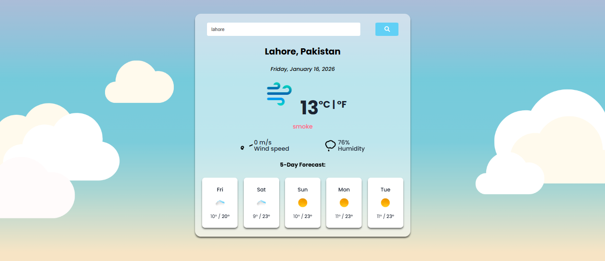

# React Weather App

## Overview
The React Weather App is a web-based application developed using React.js that allows users to check real-time weather conditions for cities around the world. The application provides accurate and up-to-date weather information by integrating the SheCodes Weather API.

This project was created as a final project for the SheCodes React program, with a focus on API integration, state management, and responsive UI design.

---

## Features
- Search weather conditions for any city worldwide  
- Display current temperature and weather description  
- Dynamic data fetching using an external weather API  
- Clean and user-friendly interface  

---

## Technologies & Tools
- React.js  
- JavaScript (ES6)  
- HTML5  
- CSS3  
- VS Code  
- SheCodes Weather API  

---

## Screenshots

